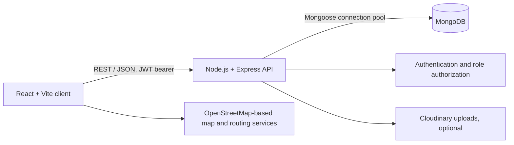

# Connect Green

A full-stack sustainable travel platform built with React, Vite, Node.js, Express, and MongoDB.

[Live Demo](https://connectgreen.onrender.com/)

## Overview

Connect Green is an educational sustainable-tourism web application. It brings together trip planning, business listings, nature-site capacity records, recycling locations, user accounts, and a demonstration carbon-offset ledger.

## Problem

Travelers often have to search across disconnected sources to find lower-impact transport, local businesses, and nature-site information. Connect Green explores how a single web platform could bring those resources together.

## Solution

The React client communicates with an Express REST API. The API uses MongoDB through Mongoose for persistence and JWT bearer tokens for authentication. Third-party OpenStreetMap-based services provide map, geocoding, and route data in parts of the planner.

## Key Features

- Role-based accounts for tourists, businesses, site managers, and administrators
- Business directory and administrator-managed badge review workflow
- Trip planning and saved trip records
- Nature-site visitor-count records with capacity status calculations
- Recycling-center discovery
- Rule-based carbon estimates in the trip planner
- Demonstration carbon-offset catalog and ledger; no payment or credit issuance occurs
- Site-manager applications and role approval

## Architecture



There is no FastAPI service, PostgreSQL database, biometric authentication, ML inference pipeline, transaction-monitoring rule engine, or production sensor stream in this repository.

## Technology Stack

- Frontend: React 18, Vite, React Router, Tailwind CSS, MapLibre/react-map-gl, Recharts
- Backend: Node.js, Express 4, Mongoose 8, MongoDB
- Authentication: bcryptjs password hashing and signed JWT bearer tokens
- Optional media storage: Cloudinary
- Tests: Node.js built-in test runner; ESLint for the client

## Project Structure

```text
client/              React application and Vite configuration
server/config/        MongoDB and security configuration
server/controllers/   Express request handlers
server/middleware/    Authentication, authorization, and uploads
server/models/        Mongoose schemas and indexes
server/routes/        REST route registration
server/test/          Backend security regression tests
```

## Installation

Prerequisites: Node.js 20 or later, npm, and a MongoDB database (local or hosted).

Clone the repository and open its root in PowerShell:

```powershell
git clone https://github.com/thearya-works/CONNECTGREEN.git
Set-Location CONNECTGREEN
```

Install dependencies and create local environment files:

```powershell
npm run install-server
npm run install-client
Copy-Item server/.env.example server/.env
Copy-Item client/.env.example client/.env
```

Set the values in `server/.env`. At minimum, provide `MONGO_URI`, a random `JWT_SECRET` of at least 32 bytes, `NODE_ENV=development`, and `ALLOWED_ORIGINS=http://localhost:5173`. Generate a JWT secret with:

```powershell
node -e "process.stdout.write(require('crypto').randomBytes(48).toString('hex'))"
```

Keep real values only in local environment files or a secret manager. Never commit `.env` files.

## Database Setup

The server uses MongoDB and Mongoose-managed schemas/indexes. There is no formal migration framework. For a local MongoDB instance, set `MONGO_URI=mongodb://127.0.0.1:27017/connect_green` in `server/.env`. For MongoDB Atlas, create a database user, restrict network access to the developer/server IPs, copy the application's driver URI, and put it in `MONGO_URI`. URL-encode special characters in the database username or password. Do not use a public `0.0.0.0/0` network rule for production.

For a disposable development database only, seed sample records by setting a private `DEMO_PASSWORD` (at least 12 characters) in `server/.env`, then explicitly enabling the destructive seed operation for that command:

```powershell
$env:ALLOW_DESTRUCTIVE_SEED = 'true'
node server/seedAll.js
Remove-Item Env:ALLOW_DESTRUCTIVE_SEED
```

The seed script clears the users, businesses, nature sites, recycling centers, and offset-project collections before inserting records. Use an empty development database; never point it at production or valuable data. Seeded people and records are demo fixtures, not real service providers or verified projects.

## Running Locally

Start the API in one terminal:

```powershell
npm run dev --prefix server
```

Start the frontend in a second terminal:

```powershell
npm run dev --prefix client
```

Open the Vite URL printed by the client (normally `http://localhost:5173`). The Vite development server proxies `/api` to port 5000.

## Testing

```powershell
npm test --prefix server
npm run lint --prefix client
npm run build
```

The root production build installs the locked client/server dependencies and builds the Vite frontend. Backend tests currently cover production configuration, public registration role policy, and safe API error mapping. There is not yet an automated MongoDB-backed integration suite or checked-in browser test suite.

## Demo

Use the development-only seed script with a disposable database and a private `DEMO_PASSWORD`. Seeded records are labeled as demo content. Nature-site counts are manually stored values, not IoT readings. Carbon-offset entries only create a demonstration record; no money is transferred and no carbon credits are purchased or issued.

## Security Notes

- Production startup requires `JWT_SECRET` (at least 32 bytes), `MONGO_URI`, and explicit `ALLOWED_ORIGINS`.
- CORS uses only configured origins; credentialed wildcard CORS is not enabled.
- Public registration supports tourist and business roles only. Site-manager access follows administrator approval; administrator provisioning requires an authenticated admin account.
- The application has no self-service first-admin bootstrap. Provision the initial production administrator through a controlled, audited database operation before enabling admin workflows.
- Authentication endpoints have IP-level rate limits. Authorization is enforced on protected routes.
- The current client stores JWTs in `localStorage`; this is exposed to successful same-origin script injection and is not a hardened production session design.
- The checked-in `.env.example` contains placeholders only. Rotate any credential that has been exposed outside its secret store.
- Database seed/migration utilities that remove records require explicit development-only confirmation flags.

## Limitations

- Biometric authentication: not implemented.
- Machine-learning risk scoring or the referenced 26-feature contract: not implemented.
- Production real-time transaction/site streaming: not implemented; nature capacity is manually updated or demo data.
- Carbon-offset payment processing and independent project verification: not implemented; ledger is demonstration-only.
- Carbon estimates and route suggestions are informational and are not independently validated environmental measurements.
- MongoDB is the only database implementation; there are no SQL migrations or PostgreSQL support.
- Automated integration, accessibility, security-penetration, and browser tests remain necessary before any production deployment.

## Feature Status

| Feature | Status |
| --- | --- |
| Authentication and role checks | IMPLEMENTED; unit-tested policy/config only, integration not verified |
| MongoDB persistence | IMPLEMENTED; connection and CRUD workflows not integration-tested here |
| Trip planner and external route data | PARTIAL; route services and estimates are informational |
| Business review and badge workflow | IMPLEMENTED; platform review is not independent certification |
| Nature-site capacity records | DEMO ONLY; manual values, no live sensors |
| Recycling directory | DEMO ONLY; sample records require independent verification |
| Carbon offset catalog and ledger | DEMO ONLY; no payment or credit issuance |
| Biometric authentication | NOT IMPLEMENTED |
| 26-feature ML/XGBoost inference | NOT IMPLEMENTED |
| Banking rules, transaction alerts, cases, and network intelligence | NOT IMPLEMENTED |
| PostgreSQL and Alembic migrations | NOT IMPLEMENTED; this project uses MongoDB/Mongoose |

## Future Improvements

Add MongoDB-backed authorization and workflow tests, move browser authentication to secure HttpOnly cookies with CSRF protection, add auditable data provenance for listings and environmental claims, and integrate real sensor/payment providers only with appropriate operational and compliance controls.

## License

This project is distributed under the MIT License. See [LICENSE](LICENSE).
